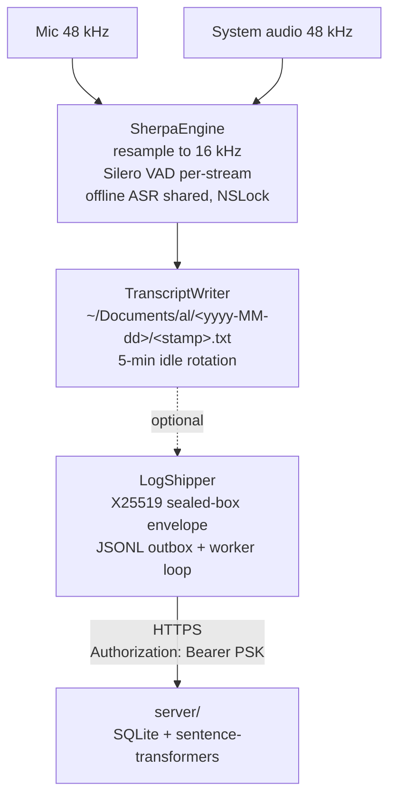

# Al (Always Listen) — context for Claude

A minimal, no-Xcode macOS menu-bar app that continuously transcribes the
microphone and system audio (independently) via sherpa-onnx (Silero VAD +
a user-selectable offline ASR model) and appends the resulting text to a
rolling log file under `~/Documents/al/`. No translation, no recordings.
The popover shows the last 200 lines but the on-disk file is authoritative.

> **Process rule for future edits**
>
> Any meaningful change to source layout, data flow, or runtime behavior
> MUST be reflected in this file in the same commit. Add numbered entries
> to "Things that have bitten us" when a real bug bites.

## How it's built

- Pure SwiftPM + pre-built sherpa-onnx dylibs (no Xcode, no CMake).
- `./build.sh` runs `tools/download-sherpa.sh` (idempotent download of
  sherpa-onnx dylibs + models), then `swift build -c release`, then wraps
  the binary into `build/Al.app/`. Use:
  ```sh
  LIVETRANSLATE_SIGN_IDENTITY=LiveTranslateDev ./build.sh
  ```
  Reusing the same signing identity keeps TCC grants valid across rebuilds
  (grants are keyed on cert identity + bundle ID).
- Launch via `open build/Al.app` — never run the binary directly.

## Architecture



## VAD / ASR

Both streams use Silero VAD (sherpa-onnx, 512-sample chunks at 16 kHz):
- `threshold = 0.5` — speech probability threshold
- `min_silence_duration = 1.0s` — closes segment after 1 s of silence
- `min_speech_duration = 0.1s` — ignores noise bursts < 100 ms
- `max_speech_duration = 30s` — forces a cut on long segments

ASR is offline and VAD-chunked: when Silero closes a segment, the recognizer
decodes it in one call. The model is user-selectable in Options:

| Model | Languages | Size (int8) | Notes |
|---|---|---|---|
| **Parakeet TDT-CTC 110M** *(default)* | EN | ~99 MB | NeMo CTC head, single ONNX file, low bounded RAM, best EN quality. |
| **FastConformer CTC multilingual** | EN / DE / ES / FR | ~98 MB | NeMo CTC, the only sherpa-onnx-packaged offline model that covers German. |
| **Parakeet TDT 0.6B v3** | EN | ~465 MB | Heavy NeMo transducer (encoder/decoder/joiner). Not realtime on M1 Air; opt-in for machines with headroom. |
| **Moonshine Tiny** | EN | ~45 MB | Smallest footprint; accuracy worst of the four. |

All three load through `SherpaOnnxOfflineRecognizer` with `provider = "coreml"`.
CTC models share the same code path (`model_config.nemo_ctc.model`); Moonshine
uses its own four-file config.

If CoreML EP throws an uncatchable C++ exception on an op (`Ort::ThrowOnError`
→ SIGABRT before any Swift code can catch it), fall back to `provider = "cpu"`
in `SherpaEngine.preloadModel()` and confirm in `/tmp/al.log`.

## Files

| File | Role |
|---|---|
| `main.swift` | NSApplicationMain bootstrap; sets `.accessory` activation policy (no Dock icon). |
| `AppDelegate.swift` | Lifecycle owner. Holds `Pipeline` and `MenuBarController`. Drains pipeline on termination. |
| `MenuBarController.swift` | NSStatusItem with ear.fill SF Symbol. Click opens an `NSPopover` (behavior `.transient`) hosting `MenuBarContentView` via `NSHostingController`. Owns `MenuBarViewModel` and bridges Pipeline callbacks → `@MainActor` state mutations. |
| `MenuBarContentView.swift` | SwiftUI popover content: status row, Start/Stop + log buttons, permission chips, a scrolling live transcript list (last 200 utterances, auto-scroll to bottom), Options…, Quit. `MenuBarViewModel` is `ObservableObject`; the on-disk transcript remains the source of truth. |
| `OptionsWindow.swift` | Singleton `NSWindowController` + SwiftUI form for the local-transcripts toggle, log-shipping server URL, and pre-shared key. Includes a Test Connection button that hits `GET /pubkey`. |
| `BrowserWindow.swift` | Singleton `NSWindowController` + SwiftUI browser. Talks to the configured server via `AlClient` (`/search`, `/search/semantic`, `/documents`, `/document/{id}`). Hidden if shipping isn't configured. |
| `Settings.swift` | `@MainActor ObservableObject` wrapping `UserDefaults` for `serverURL`, `psk`, `writeLocally` (default true), and a stable per-install `clientId` (UUID). Posts `Settings.didChange` on save. |
| `Crypto.swift` | X25519 sealed-box wrapper using CryptoKit: ephemeral keypair + HKDF-SHA256 + ChaCha20-Poly1305. Wire format documented in the file header. |
| `LogShipper.swift` | Swift actor. Owns the on-disk outbox (`~/Library/Application Support/al/outbox.jsonl`), fetches the server pubkey on demand, refetches before `valid_until`, and ships sealed batches with at-least-once semantics (server PK dedupes). Idle when shipping is unconfigured. |
| `Pipeline.swift` | Top-level orchestrator. Wires sources→denoiser→engine→writer→shipper. Owns hourly RSS heartbeat. |
| `Types.swift` | `SourceTag` (mic/system), `AudioSource` protocol, `Utterance` struct. |
| `MicSource.swift` | AVAudioEngine mic capture, 48 kHz mono Float32. Auto-restarts on config change. |
| `SystemAudioSource.swift` | ScreenCaptureKit system audio capture, 48 kHz mono Float32. Exponential-backoff reconnect. |
| `BufferBroadcaster.swift` | Fans AVAudioPCMBuffers out to multiple AsyncStream subscribers. Bounded to 200 buffers per consumer. |
| `SherpaEngine.swift` | Silero VAD + user-selectable offline ASR via sherpa-onnx C API. Per-stream VAD, shared recognizer (NSLock). Crosstalk suppression (zeros mic samples when system audio voiced within 250 ms, in-place vDSP fill). |
| `TranscriptWriter.swift` | Swift actor. Appends utterance text to `~/Documents/al/<yyyy-MM-dd>/<stamp>.txt`. Rotates on 5-minute idle gap. When `Settings.writeLocally` is false, skips all disk IO but still returns a stable virtual file_id for the shipper. |
| `Permissions.swift` | Non-prompting TCC status probes for microphone and screen recording. |
| `Log.swift` | Append-only logger to `/tmp/al.log`. Truncates on launch if > 5 MB. |
| `CSherpa/` | SwiftPM bridge target linking libsherpa-onnx-c-api.dylib from `build/sherpa-prefix/`. |
| `../server/` | Optional Python/FastAPI companion server (Dockerized). Stores sealed lines, decrypts on receipt, groups entries into server-side documents by temporal proximity (across all clients), and exposes text + sentence-transformers semantic search. Rotates X25519 keypairs with overlap and a retention window. See `server/README.md`. |

## Manual smoke test

1. `tccutil reset Microphone local.mtib.al && tccutil reset ScreenCapture local.mtib.al`
2. `LIVETRANSLATE_SIGN_IDENTITY=LiveTranslateDev ./build.sh && open build/Al.app`
3. Grant both permissions when prompted.
4. Speak a sentence. Shortly after you stop speaking (Silero closes the segment after ~1.5 s of silence, then ASR runs), `tail -f /tmp/al.log` should show `SherpaEngine[mic]: "…"`.
5. `cat ~/Documents/al/**/*.txt | tail -5` — lines should appear.
6. Stop, wait 5+ min, Start, speak — a **new file** should appear in `~/Documents/al/<date>/`.
7. Memory check: `ps -o rss,command -p $(pgrep -f 'build/Al.app')` — RSS should plateau (~300 MB).
8. Quit — `/tmp/al.log` ends with `Al: bye`.

### Log shipping (optional)

1. `cd server && AL_PSK="$(openssl rand -hex 32)" docker compose up --build -d`
2. In the menu-bar popover → **Options…**, paste the URL (`http://localhost:8088`) and the same PSK. Click **Test connection** — it should report "valid for ~7 days".
3. Speak — `/tmp/al.log` should show `LogShipper: acked up to seq=…` within ~30 s.
4. Search: `curl -sH "Authorization: Bearer $AL_PSK" 'http://localhost:8088/search?q=hello' | jq .`
5. Semantic: `curl -sH "Authorization: Bearer $AL_PSK" 'http://localhost:8088/search/semantic?q=meeting' | jq .`

## Things that have bitten us

1. **CoreML provider can throw uncatchable C++ exceptions during recognizer
   init.** `Ort::ThrowOnError` → SIGABRT, before any Swift code can catch it.
   Stick with `provider = "cpu"` for transducer models unless you've verified
   every op compiles under CoreML EP. The CTC-head models we ship currently
   (Parakeet TDT-CTC 110M, FastConformer CTC multilingual) are CoreML-clean.

2. **Parakeet TDT 0.6B v3 was not real-time on M1 Air.** The 0.6B
   encoder-decoder transducer peaked at ~3 GB RSS and fell behind on combined
   mic + system audio. We dropped it in favour of the 110M CTC variant, which
   is ~5× smaller and bounded under 1 GB total even with both streams running.
   If you reintroduce an encoder-decoder model, benchmark on Air first.

3. **NSString lifetime across C calls.** `path as NSString → .utf8String`
   returns a `char*` whose lifetime is tied to the NSString. ARC will release
   the NSString as soon as it's out of the immediate expression, leaving
   sherpa-onnx pointed at freed memory. `preloadModel` keeps an explicit
   `keepAlive: [NSString]` array that survives until after
   `SherpaOnnxCreateOfflineRecognizer` returns.

## Log-shipping protocol

The server's wire format and rotation policy are authoritative; the client
side mirrors it. Refer to `Sources/Al/Crypto.swift` and `server/README.md`
for the envelope spec. Two design rules worth carrying forward:

- **Server determines document boundaries.** The client's per-file split is
  written to disk verbatim but the server re-groups all entries (across all
  clients) by temporal proximity using `AL_DOCUMENT_GAP_SECONDS`. Don't add
  client-side aggregation that the server then has to undo.
- **Pubkey carries `valid_until`.** Server auto-rotates X25519 keys and
  keeps old private halves around for a retention window. Client refreshes
  the cached key when it has < 6 h remaining. If you rotate the key
  manually, in-flight ciphertexts still decrypt.
